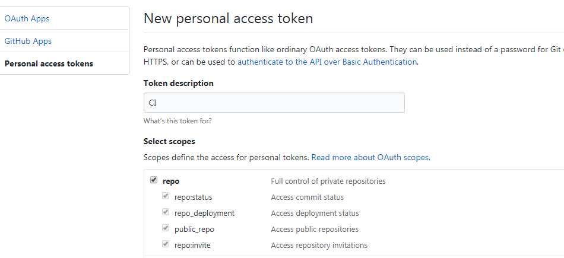
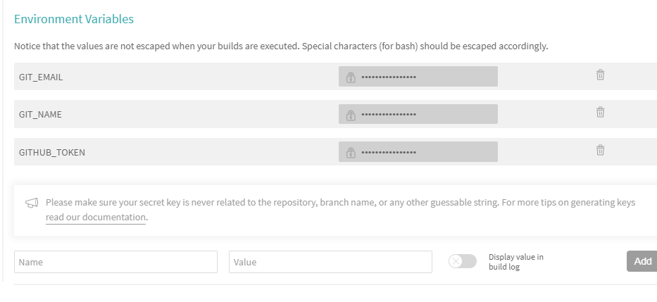

# 持续集成

## 什么是持续集成？

> 持续集成（英语：Continuous integration，缩写 CI）是一种软件工程流程，是将所有软件工程师对于软件的工作副本持续集成到共享主线（mainline）的一种举措。

本次我们以 `gitbook` 为例，只要修改了书籍源文件，提交代码到远程，自动触发构建，生成静态页面提供访问。

## 注册 Travis CI 账号，绑定 GitHub 账户

首先，我们到 [Travis CI 官网](https://travis-ci.org/) 用自己的 GitHub 账户直接关联登录，并允许 Travis CI 查看自己的公有仓库。

然后我们到 [Travis CI 账户页面](https://travis-ci.org/account/repositories), 开启对应工程, 如下：


## 配置持续集成文件

`.travis.yml` 是 `Travis CI` 的部署配置文件，`Travis CI` 部署时会自动读取我们每次 Commit 中是否包含 .travis.yml，有此文件才会开始部署。

### 创建 `.travis.yml` 配置文件

```yaml
language: node_js # 编译语言、环境
node_js: stable # Node.js 版本

branches:
  only:
    - master # 只有master分支更改才触发CI

install:
  - npm install gitbook-cli -g # 安装 gitbook
  - gitbook install # 安装 gitbook 插件

script: # 执行脚本，生成静态文件
  - gitbook build

deploy:
  provider: pages
  skip_cleanup: true # 跳过清理
  local_dir: _book # 需要推送到Github的静态文件目录
  name: $GIT_NAME # 用户名变量
  email: $GIT_EMAIL # 用户邮箱变量
  github_token: $GITHUB_TOKEN # GitHub Token变量
  keep-history: true # 保持推送记录，以增量提交的方式
  target-branch: gh-pages # 推送的目标分支 local_dir->>gh-pages分支, 不包含_book目录
  on:
    branch: master # 工作分支
```

### 在 Travis CI 中配置变量

* $GIT_NAME：git 用户名
* $GIT_EMAIL：git 用户邮箱
* $GITHUB_TOKEN：GitHub 通行证 (token) 字符串

GitHub 通行证 (token) 我们在 GitHub 中进行申请

* 访问 [GitHub 账户设置](https://github.com/settings/tokens) > Tokens
* 生成新 Token: Generate new token
* 填入 Token 描述，并给予 Token 第一项 repo 的全部权限



在 `Travis CI` 仓库配置中，将三个变量填入设置（位于 `Settings > Environment Variables` 处）并保存:




## 自动部署

```js
git add .
git commit -m "Publish new book."
# 推送到远程仓库
git push
```

每次修改书籍后，发布远程仓库，自动构建，且发送到 `gh-pages` 分支。

既保留源码，又自动构建。